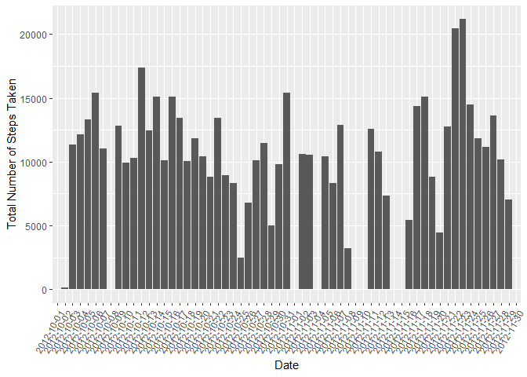
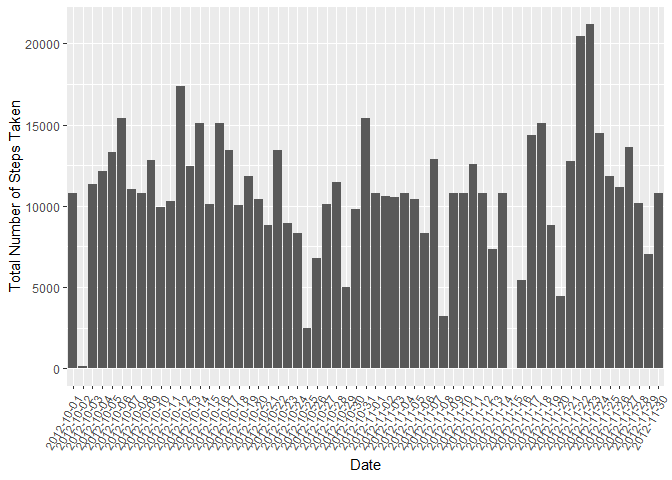

```r
library(dplyr)
library(ggplot2)
#library(scales)
library(mice)
```

## Loading and preprocessing the data


```r
# extract activity csv if it does not exist
if (!file.exists("activity.csv"))
{
  unzip("activity.zip")
}

# load data
activity <- read.csv("activity.csv", header=TRUE, na.strings=c("NA"))
```

## What is mean total number of steps taken per day?


```r
# 1. Calculate the total number of steps taken per day
total_steps_by_date <- activity %>% group_by(date) %>% summarize(steps=sum(steps, na.rm=TRUE))

# 2. Make a histogram of the total number of steps taken each day
plot1 <- ggplot(activity, aes(x=date, weights=steps)) 
plot1 <- plot1 + labs(x = "Date", y = "Total Number of Steps Taken")
plot1 + geom_histogram(stat="count")
```

<!-- -->

```r
# 3.Calculate and report the mean and median of the total number of steps taken per day

mean_total_steps <- mean(total_steps_by_date$steps, na.rm=TRUE)
median_total_steps <- median(total_steps_by_date$steps, na.rm=TRUE)
```

The mean total number of steps is 9354.23.  
The median total number of steps is  10395.

## What is the average daily activity pattern?


```r
# 1. Make a time series plot (i.e. \color{red}{\verb|type = "l"|}type = "l") of the 5-minute interval (x-axis) and the average number of steps taken, averaged across all days (y-axis)

average_steps_by_interval <- activity %>% group_by(interval) %>% summarize(mean_steps=mean(steps, na.rm=TRUE))

plot2 <- ggplot(average_steps_by_interval, aes(interval, mean_steps)) 
plot2 <- plot2 + labs(x="5-Minute Interval", y="Average Number of Steps Taken")
plot2 + geom_point()
```

<!-- -->

```r
# 2. Which 5-minute interval, on average across all the days in the dataset, contains the maximum number of steps?

greatest_interval <- subset(average_steps_by_interval, average_steps_by_interval$mean_steps == max(average_steps_by_interval$mean_steps, na.rm=TRUE))$interval
```

The 5-minute interval 835 on average contains the maximum number of steps.  

## Imputing missing values


```r
# 1. Calculate and report the total number of missing values in the dataset

total_number_of_missing_values <- sum(is.na(activity$steps))

# 2. Devise a strategy for filling in all of the missing values in the dataset. The strategy does not need to be sophisticated. For example, you could use the mean/median for that day, or the mean for that 5-minute interval, etc.

percent_missing_activity_values <- 100 * colSums(is.na(activity)) / count(activity)$n
percent_missing_average_by_interval_values <- 100 * colSums(is.na(average_steps_by_interval)) / count(average_steps_by_interval)$n
```

The total # of missing step values is 2304.  
the percent of missing step, date, and interval values from the activity dataset are 13.1147541, 0, 0 respectively.  
While the percent of missing step and interval from the 5 minute averages dataset are 0, 0.  
For the purposes of this exercise data will be imputed using the average of the 5 minute interval.


```r
# 3. Create a new dataset that is equal to the original dataset but with the missing data filled in.

imputed_activity <- inner_join(activity, average_steps_by_interval, by="interval") %>% mutate(steps = ifelse(is.na(steps), mean_steps, steps)) %>% select(-mean_steps)

# 4. Make a histogram of the total number of steps taken each day and Calculate and report the mean and median total number of steps taken per day. Do these values differ from the estimates from the first part of the assignment? What is the impact of imputing missing data on the estimates of the total daily number of steps?

total_imputed_steps_by_date <- imputed_activity %>% group_by(date) %>% summarize(steps=sum(steps, na.rm=TRUE))

plot3 <- ggplot(imputed_activity, aes(x=date, weights=steps)) 
plot3 <- plot3 + labs(x = "Date", y = "Total Number of Steps Taken")
plot3 + geom_histogram(stat="count")
```

<!-- -->

```r
mean_total_imputed_steps <- mean(total_imputed_steps_by_date$steps, na.rm=TRUE)
median_total_imputed_steps <- median(total_imputed_steps_by_date$steps, na.rm=TRUE)
```

The mean total imputed number of steps is 10766.19.  
The median total imputed number of steps is  10766.19.  
The imputed mena and median are slightly higher than the original data.

## Are there differences in activity patterns between weekdays and weekends?


```r
average_steps_by_interval_weekend <- activity %>% mutate(dow=(as.POSIXlt(date)$wday)) %>% mutate(wd=ifelse((dow > 0 & dow < 6), "weekday", "weekend")) %>% group_by(interval, wd) %>% summarize(mean_steps=mean(steps, na.rm=TRUE))

plot4 <- ggplot(average_steps_by_interval_weekend, aes(interval, mean_steps)) 
plot4 <- plot4 + facet_grid(wd ~ .)
plot4 <- plot4 + labs(x="5-Minute Interval", y="Average Number of Steps Taken")
plot4 + geom_point()
```

<!-- -->

Weekday patterns show more average steps earlier in the day and weekend patterns show a more even distribution of steps.
